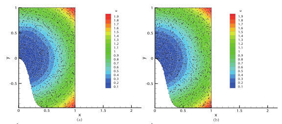
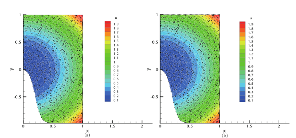

# RBF-DQ

Solving Advection-diffusion Equation with Local Radial Basis Function-based Differential Quadrature Method

## How to run

Run [`Main.py`](src/Main.py) to solve the equations.

## Warning

This repo is just a class assignment. The code may not be clean and efficient. I cannot guarantee that the results are absolutely right.

## Results

You can find all results in this [report](documents/Report.pdf).

Some results:

